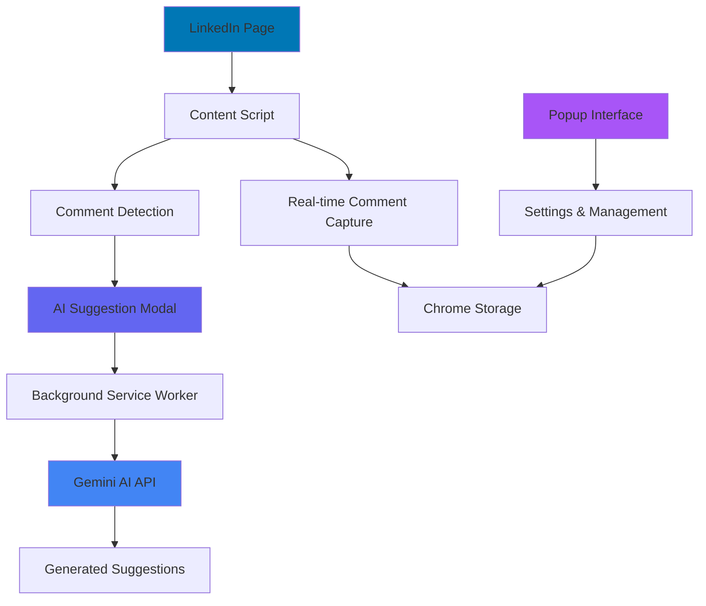
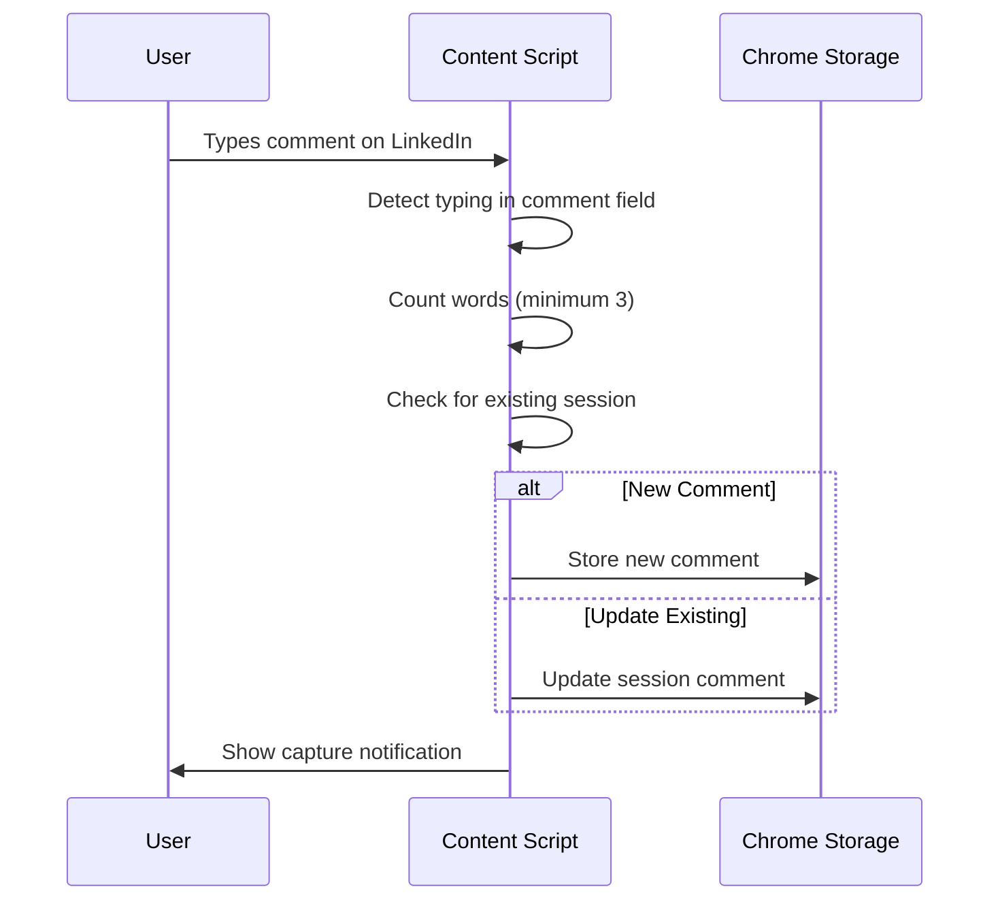
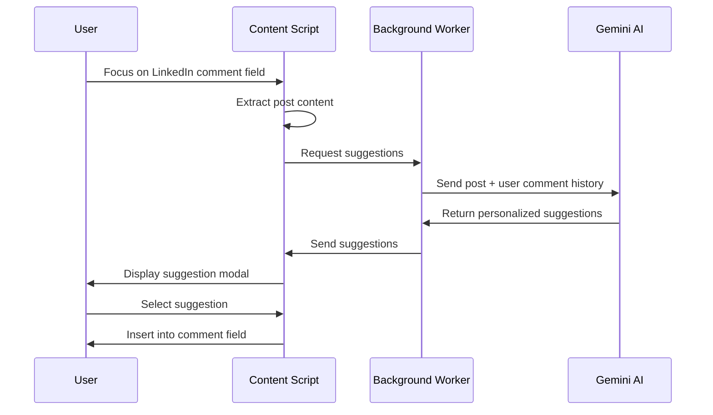

# 🤖 YouSaid AI - Intelligent LinkedIn Comment Assistant

<div align="center">


**Transform your LinkedIn engagement with AI-powered, personalized comment suggestions**

[](https://www.typescriptlang.org/)
[](https://reactjs.org/)
[](https://vitejs.dev/)
[](https://tailwindcss.com/)
[](https://developer.chrome.com/docs/extensions/)

[Features](#-features) • [Quick Start](#-quick-start) • [Tech Stack](#-tech-stack) • [Documentation](#-documentation)

</div>

---

## 🌟 Features

### 🧠 Smart Learning System

- **Real-time Comment Capture**: Automatically learns from your LinkedIn commenting style  
- **Personalized AI**: Generates suggestions that match your unique tone and writing patterns  
- **Session-based Tracking**: Intelligently updates comments as you type and edit  
- **Comment History Archive**: Securely saves all your past comments in a searchable archive, so you can reuse or reference them anytime you need.


### ✨ **AI-Powered Assistance**
- **Contextual Suggestions**: Analyzes LinkedIn post content to provide relevant comments
- **Grammar Correction**: Built-in grammar and spelling correction with AI
- **Manual Input Support**: Write your own comments with optional AI enhancement

### 🎨 **Modern UI/UX**
- **Glassmorphism Design**: Beautiful, modern interface with blur effects
- **Dark Theme**: Easy on the eyes during long LinkedIn sessions
- **Responsive Modal**: Smooth animations and intuitive interactions

---

## 🚀 Quick Start

### Prerequisites

- **Node.js** (v16 or higher)
- **npm** or **yarn**
- **Google Chrome** browser
- **Gemini AI API Key** ([Get it here](https://makersuite.google.com/app/apikey))

### 📥 Installation

```bash
# Clone the repository
git clone https://github.com/yourusername/yousaid-ai.git
cd yousaid-ai/echotype

# Install dependencies
npm install

# Build the extension
npm run build:extension
```

### 🔧 Setup Chrome Extension

1. **Open Chrome Extensions Page**
   ```
   chrome://extensions/
   ```

2. **Enable Developer Mode**
   - Toggle the "Developer mode" switch (top right)

3. **Load Extension**
   - Click "Load unpacked"
   - Select the `dist` folder from the project

4. **Configure API Key**
   - Click the YouSaid AI extension icon
   - Go to Settings (⚙️)
   - Enter your Gemini API key

### 🎯 Usage

1. **Visit LinkedIn** and navigate to any post
2. **Focus on a comment field** - YouSaid AI modal appears
3. **Choose from AI suggestions** or write your own comment
4. **Use grammar correction** if needed
5. **Click to insert** - Your comment is added!

---

## 🛠 Tech Stack

<table align="center">
<tr>
<td align="center"><strong>Frontend</strong></td>
<td align="center"><strong>Build Tools</strong></td>
<td align="center"><strong>AI & APIs</strong></td>
</tr>
<tr>
<td>

- **React 18** - Popup interface
- **TypeScript** - Type safety
- **Tailwind CSS** - Styling
- **Vanilla JS** - Content scripts

</td>
<td>

- **Vite** - Fast build tool
- **ESLint** - Code linting
- **PostCSS** - CSS processing
- **Custom Build Script** - Extension packaging

</td>
<td>

- **Gemini 1.5 Flash** - AI text generation
- **Chrome Extension APIs** - Browser integration
- **Chrome Storage API** - Data persistence

</td>
</tr>
</table>

### 🏗 Architecture Overview



---

## 📂 Project Structure

```
echotype/
├── 📁 src/
│   ├── 📄 content.ts           # Main content script logic
│   ├── 📄 background.ts        # Service worker for API calls
│   ├── 📄 vite-env.d.ts       # TypeScript environment definitions
│   └── 📁 popup/
│       ├── 📄 index.tsx        # React popup component
│       ├── 📄 index.html       # Popup HTML template
│       └── 📄 style.css        # Popup styling
├── 📁 public/
│   └── 📁 icons/              # Extension icons (16px, 32px, 48px, 128px)
├── 📄 manifest.json           # Chrome extension configuration
├── 📄 build-extension.sh      # Custom build script
├── 📄 package.json           # Project dependencies
├── 📄 vite.config.ts         # Vite configuration
├── 📄 tailwind.config.cjs    # Tailwind CSS configuration
├── 📄 postcss.config.cjs     # PostCSS configuration
├── 📄 tsconfig.json          # TypeScript configuration
└── 📄 eslint.config.js       # ESLint configuration
```

---

## 📋 Build Scripts

| Command | Description | Usage |
|---------|-------------|--------|
| `npm run build:extension` | **Main build command** - Builds TypeScript, bundles with Vite, and copies files to `dist/` | Primary development command |
| `npm run build` | **Vite build only** - Compiles and bundles the code | Used internally by build script |
| `npm run dev` | **Development mode** - Starts Vite dev server for popup development | For popup UI development |
| `npm run lint` | **Code linting** - Runs ESLint on TypeScript files | Code quality checks |

### 🔨 Build Process

The `build-extension.sh` script performs these steps:

1. **TypeScript Compilation** - Compiles `.ts` files
2. **Vite Bundling** - Bundles React popup and assets
3. **File Copying** - Copies manifest, icons, and assets to `dist/`
4. **HTML Processing** - Renames and processes popup HTML
5. **Validation** - Lists generated files and sizes

---

## 📖 Documentation

### 🗂 File Details

<details>
<summary><strong>📄 src/content.ts</strong> - Core LinkedIn Integration</summary>

**Purpose**: Main content script that runs on LinkedIn pages to capture comments and show AI suggestions.

**Key Functions**:
- `captureTypedComment()` - Captures user comments as they type
- `showCommentSuggestions()` - Displays AI suggestion modal
- `setupTypingDetection()` - Sets up event listeners for comment fields
- `extractPostContent()` - Extracts LinkedIn post content for context
- `insertSuggestion()` - Inserts selected comment into LinkedIn field
- `displaySuggestions()` - Renders suggestion modal with manual input options

</details>

<details>
<summary><strong>📄 src/background.ts</strong> - AI Service Worker</summary>

**Purpose**: Background service worker that handles API communication with Gemini AI.

**Key Functions**:
- `callGeminiWithUserKey()` - Generates personalized comment suggestions
- `correctGrammarWithUserKey()` - Provides grammar correction for user comments
- Chrome message listener for handling requests from content script

</details>

<details>
<summary><strong>📄 src/popup/index.tsx</strong> - Settings Interface</summary>

**Purpose**: React-based popup interface for extension management and settings.

**Key Functions**:
- `saveApiKey()` - Stores Gemini API key securely
- `clearAllComments()` - Clears captured comment history
- `editCapturedComment()` - Allows editing of captured comments
- `saveManualComments()` - Saves manually entered comments for learning

</details>

### 🔧 Core Functions Reference

#### Content Script (`content.ts`)

| Function | Parameters | Purpose |
|----------|------------|---------|
| `countWords(text)` | `text: string` | Counts words in comment text |
| `captureTypedComment(commentText, source)` | `commentText: string, source: string` | Captures and stores user comments with session tracking |
| `setupTypingDetection()` | None | Initializes event listeners for LinkedIn comment fields |
| `showCommentSuggestions(field, content)` | `commentField: HTMLElement, postContent: string` | Shows AI suggestion modal |
| `extractPostContent(field)` | `commentField: HTMLElement` | Extracts LinkedIn post content for context |
| `insertSuggestion(field, suggestion)` | `commentField: HTMLElement, suggestion: string` | Inserts comment into LinkedIn field |

#### Background Worker (`background.ts`)

| Function | Parameters | Purpose |
|----------|------------|---------|
| `callGeminiWithUserKey(message, apiKey, response)` | `message: object, apiKey: string, sendResponse: function` | Generates AI comment suggestions |
| `correctGrammarWithUserKey(message, apiKey, response)` | `message: object, apiKey: string, sendResponse: function` | Corrects grammar in user comments |

#### Popup Interface (`popup/index.tsx`)

| Function | Parameters | Purpose |
|----------|------------|---------|
| `saveApiKey()` | None | Saves Gemini API key to Chrome storage |
| `clearAllComments()` | None | Clears all captured comments and resets session |
| `editCapturedComment(index, newComment)` | `index: number, newComment: string` | Updates existing captured comment |
| `deleteCapturedComment(index)` | `index: number` | Removes specific captured comment |

---

## 🎯 How It Works

### 💭 Comment Learning System



### 🤖 AI Suggestion Flow



### 📊 Data Flow Architecture

| Component | Data In | Data Out | Storage |
|-----------|---------|----------|---------|
| **Content Script** | User typing, LinkedIn posts | Captured comments, post context | Chrome Storage (comments) |
| **Background Worker** | API requests, user data | AI suggestions, corrected text | Chrome Storage (API key) |
| **Popup Interface** | User settings, manual comments | Configuration, comment management | Chrome Storage (settings) |

---

## 🎨 UI Components

### 🖼 Suggestion Modal Features

- **📝 Post Context Display**: Shows relevant LinkedIn post content
- **🎯 AI Suggestions**: 3 personalized comment suggestions
- **✍️ Manual Input**: Custom comment input with grammar correction
- **📝 Grammar Check**: AI-powered grammar and spelling correction
- **✅ Accept/Discard**: Options for corrected comments

### 🎪 Visual States

| State | Description | Visual Indicator |
|-------|-------------|------------------|
| **Loading** | Generating suggestions | Spinning animation with gradient text |
| **Suggestions** | Showing AI recommendations | Cards with hover effects |
| **Manual Input** | User writing custom comment | Purple-themed input section |
| **Grammar Check** | Correcting user text | Highlighted correction section |
| **Error** | API or context issues | Red error messages with icons |

---

## 🔒 Privacy & Security

- **🔐 Local Storage**: All data stored locally in Chrome storage
- **🚫 No Data Collection**: No user data sent to external servers (except Gemini API)
- **🔑 API Key Security**: Gemini API key stored securely in Chrome storage
- **🛡 Content Security**: Content script only accesses LinkedIn comment fields

---

## 🤝 Contributing

We welcome contributions! Please feel free to submit pull requests, report issues, or suggest new features.

### Development Setup

1. Fork the repository
2. Create a feature branch
3. Make your changes
4. Test thoroughly on LinkedIn
5. Submit a pull request

---

## 📄 License

This project is licensed under the MIT License - see the [LICENSE](LICENSE) file for details.

---

## 🙏 Acknowledgments

- **Google Gemini AI** for providing the AI capabilities
- **LinkedIn** for the platform that inspired this tool
- **Chrome Extensions Team** for the robust extension APIs
- **Open Source Community** for the amazing tools and libraries

---

<div align="center">

**Made with ❤️ for better LinkedIn engagement**

[⭐ Star this repo](https://github.com/yourusername/yousaid-ai) • [🐛 Report Bug](https://github.com/yourusername/yousaid-ai/issues) • [💡 Request Feature](https://github.com/yourusername/yousaid-ai/issues)

</div>